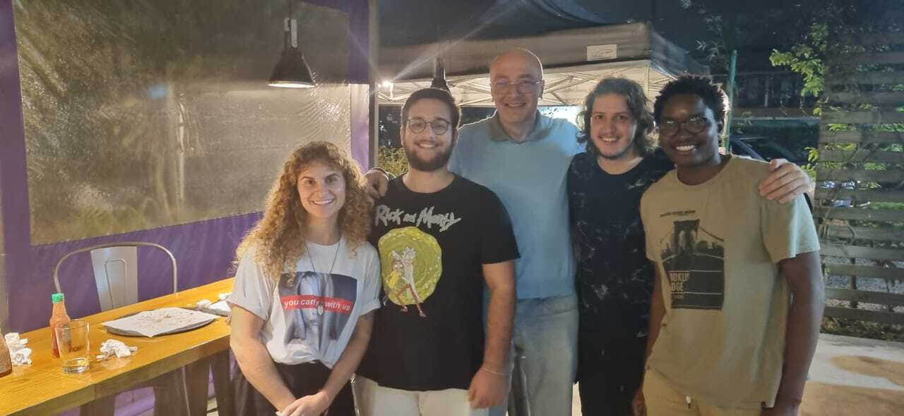

🌊 Ocean Dynamic Laboratory Repository 🌊

Welcome to the Ocean Dynamic Laboratory at the Federal University of Santa Catarina! Explore our research on ocean dynamics, climate, and numeric modeling. Join us in studying climate change, utilizing models like ROMS and Delft3D, and incorporating deep learning into oceanographic research. #OceanScience #ClimateResearch 🚀

## About Us

The Ocean Dynamic Laboratory is dedicated to the study of ocean dynamics, climate, and climate change. Our research encompasses various aspects, including numeric modeling using models like ROMS and Delft3D, processing and analysis of oceanographic data, and the incorporation of deep learning techniques into our research.

## Key Researchers

### 1. Prof. Antonio Fernando Härter Fetter Filho
   - **Lattes CV:** [Antonio Fernando Härter Fetter Filho - Lattes CV](http://lattes.cnpq.br/3964838319654009)

### 2. Prof. Felipe M. Pimenta
   - **Lattes CV:** [Felipe M. Pimenta - Lattes CV](http://lattes.cnpq.br/4853184583206201)

## Research Focus

- **Ocean Dynamics:** Investigating different types of ocean dynamics.
- **Climate and Climate Change:** Understanding the impacts of climate change on ocean patterns.
- **Numeric Modeling:** Utilizing models such as ROMS and Delft3D for simulations and predictions.
- **Data Processing and Analysis:** Implementing advanced techniques to process and analyze oceanographic data.
- **Deep Learning in Research:** Exploring the application of deep learning methods in oceanographic research.

## Current Projects

List some ongoing or recent projects that showcase the diversity and depth of your research.

1. Project A: Brief description.
2. Project B: Brief description.
3. ...

## Team Photo

## How to Contribute

We welcome contributions and collaboration! If you are interested in contributing or have any questions, feel free to reach out.

## Contact Us

- **Email:** [your-email@example.com]
- **Website:** [Ocean Dynamic Laboratory Website](https://example.com)

Follow us on [Twitter](https://twitter.com/OceanDynamicLab) for updates!

## License

This project is licensed under the [Your License Name] - see the [LICENSE](LICENSE) file for details.
